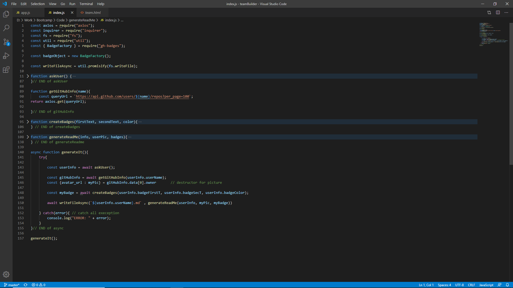

# BuildReadMe
### Description
This application assist user to build a good readme, basically user just answer all the question and then this application will generate a readme base on how user answer the question. It help user save time to write readme. In addition, user have more time to concentrate on the application.
### Installation
- axios
- inquirer
- fs
- util
- gh-badges
### test

